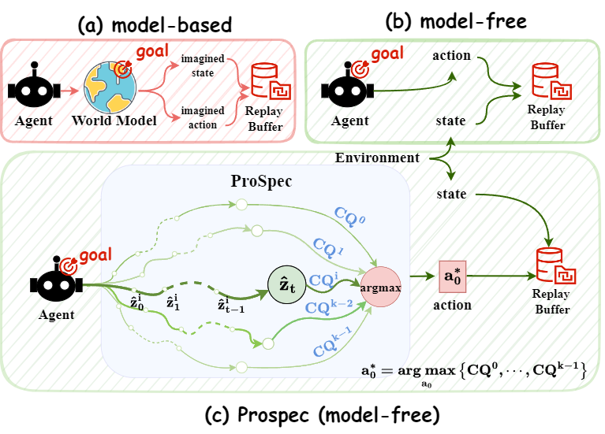
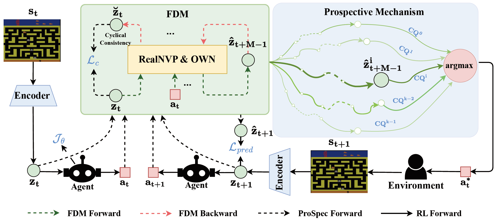
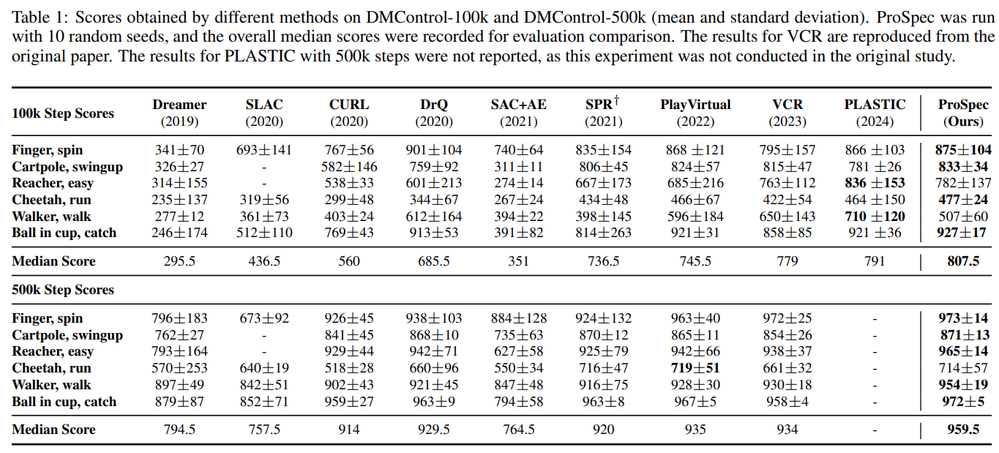
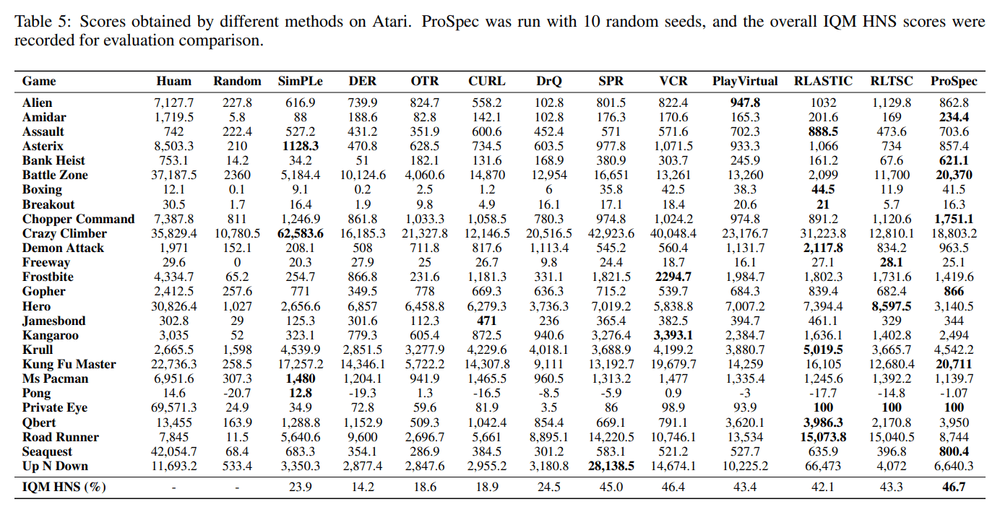

<!--
  ProSpec: Plan Ahead, Then Execute
  Anonymous Submission for NeurIPS 2025
-->

<p align="center">
  
</p>

# ProSpec: Plan Ahead, Then Execute

**Prospective Thinking (PT)**—the human ability to envision future scenarios and plan accordingly—is key to efficient decisions. Conventional model-free RL lacks this foresight, leading to data inefficiency and “dead-end” traps. **ProSpec** injects human-like PT into model-free agents, enabling them to **plan ahead** and then **execute**.

---

## 📖 Framework Overview

<p align="center">
  
</p>

---

## 🚀 Key Contributions

1. **Flow‐based Reversible Dynamics Model**  
   - Learns a bijective mapping between (state, action) and next state.  
   - Rolls out _n_ candidate trajectories from the current policy for rich future anticipation.

2. **Prospective Planning Mechanism**  
   - Model Predictive Control (MPC) with a **value consistency** constraint.  
   - “Plan ahead, then execute”: pick the action whose predicted return matches the value network.  
   - Prunes high-risk “dead-end” trajectories to avoid catastrophic failures.

3. **Cyclical Consistency Constraint**  
   - Enforces reversibility: rolling predicted future states back recovers the original.  
   - Generates abundant, accurate virtual trajectories—boosting data efficiency and stability.

---

## 📊 Experimental Results

<p align="center">
  
</p>
<p align="center">
  
</p>

| Benchmark     | Tasks | ProSpec Wins | SOTA Wins |
|--------------:|:-----:|:------------:|:---------:|
| **DMControl** | 6     | **4**        | 2         |
| **Atari**     | 26    | **8**        | 18        |

> Under limited interactions, ProSpec outperforms state-of-the-art on 4/6 DMControl tasks and 8/26 Atari games.

---

## 💻 Installation

```bash
# Clone the repository
git clone https://github.com/anonymous/ProSpec.git
cd ProSpec

# Create and activate a Conda environment
conda create -n ProSpec python=3.8 -y
conda activate ProSpec

# Install dependencies for your target domain:
# DMControl
pip install -r DMControl/requirements.txt

# Atari
pip install -r Atari/requirements.txt
